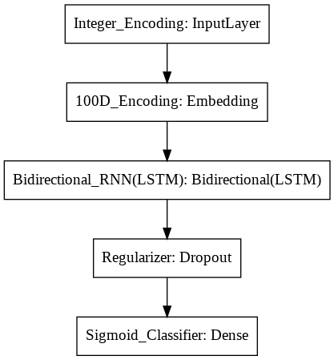
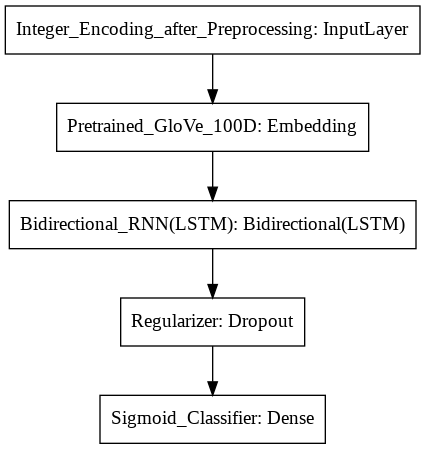
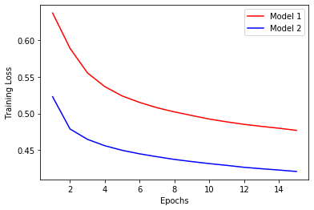
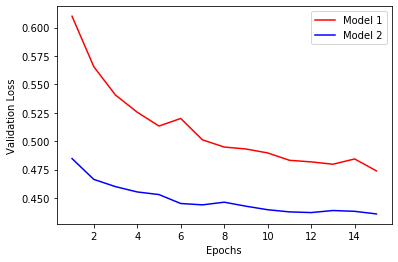
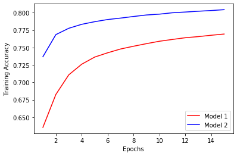
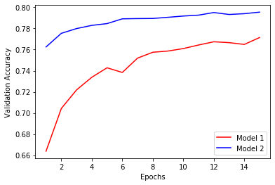

# Twitter Sentiment Analysis

This project aims to classify tweets from Twitter as having positive or negative sentiment using a Bidirectional Long Short Term Memory (Bi-LSTM) classification model. The model is trained on the [Sentiment140](https://www.kaggle.com/kazanova/sentiment140) dataset containing 1.6 million tweets from various Twitter users. Two different models are trained and compared to study the impact of the following on the produced results : 
* Preprocessing the corpus using Natural Language Toolkit (NLTK). 
* Using pre-trained Word Embeddings (GloVe).

A detailed description of this project along with the results can be found [here](#project-description-and-results).

## Getting Started

### Prerequisites
Running this project on your local system requires the following packages to be installed :

* numpy
* pandas
* matplotlib
* sklearn
* nltk
* keras
    
 They can be installed from the Python Package Index using pip as follows :
 
     pip install numpy
     pip install pandas
     pip install matplotlib
     pip install sklearn
     pip install nltk
     pip install Keras
     
     
 You can also use [Google Colab](https://colab.research.google.com/) in a Web Browser without needing to install the mentioned packages.
 
### Usage
This project is implemented as an interactive Jupyter Notebook. You just need to open the notebook on your local system or on [Google Colab](https://colab.research.google.com/) and execute the code cells in sequential order. The function of each code cell is properly explained with the help of comments. 
  Before starting you need to make sure that the path to the Sentiment140.csv and glove.6B.100d.txt files are updated according to your working environment. If you are using [Google Colab](https://colab.research.google.com/), then :
1. Mount Google Drive using : 

        from google.colab import drive
        drive.mount('/content/drive')
        
2. Update file locations as `'/content/drive/path_to_file'`.

## Tools Used
* [NumPy](https://numpy.org/) : Used for storing and manipulating high dimensional arrays.
* [Pandas](https://pandas.pydata.org/) : Used for reading the dataset from .csv file.
* [Matplotlib](https://matplotlib.org/) : Used for comparing the performance of models.
* [Sklearn](https://scikit-learn.org/stable/) : Used for performing train-test split.
* [NLTK](https://www.nltk.org/) : Used for preprocessing the corpus.
* [Keras](https://keras.io/) : Used for designing, training and evaluating the classification model.
* [Google Colab](https://colab.research.google.com/) : Used as the development environment for executing high-end computations on its backend GPUs/TPUs and for editing Jupyter Notebook. 

## Contributing
You are welcome to contribute :

1. Fork it (https://github.com/rohanrao619/Twitter_Sentiment_Analysis/fork)
2. Create new branch : `git checkout -b new_feature`
3. Commit your changes : `git commit -am 'Added new_feature'`
4. Push to the branch : `git push origin new_feature`
5. Submit a pull request !

## License
This Project is licensed under the MIT License, see the [LICENSE](LICENSE) file for details.

## Project Description and Results
### Classification Models
|||
|:--:|:--:|
|**Model_1**|**Model_2**|

The architecture of both models is nearly the same. The only difference is that Model_2 uses pre-trained 100D GloVe Embeddings (to represent tokens of the vocabulary) and Data that is preprocessed using NLTK, whereas Model_1 uses 100D Encodings with no significant meaning (to represent tokens of the vocabulary) and Data that is not preprocessed.

### Preprocessing the Corpus

Both Models have different approaches to prepare the data before feeding it to the Bi-LSTM network. Model_2 utilizes NLTK for preprocessing the data, whereas Model_1 directly works upon raw data. 

* Model_1 uses the following strategy :

  **Data -> Tokenize -> Vectorize -> Pad**
    As an example :

      Original : 
      I am in pain. My back and sides hurt. Not to mention crying is made of fail.

      Tokenized :
      ['I', 'am', 'in', 'pain.', 'My', 'back', 'and', 'sides', 'hurt.', 'Not', 'to', 'mention', 'crying', 'is',
       'made', 'of', 'fail', '.'] 

      Vectorized :
      [1, 57, 10, 2588, 5, 48, 6, 8826, 2898, 25, 2, 1418, 1086, 8, 187, 12, 2288]

      Padded :
      [1, 57, 10, 2588, 5, 48, 6, 8826, 2898, 25, 2, 1418, 1086, 8, 187, 12, 2288, 0, 0, 0]
  
* Model_2 uses the following strategy :

  **Data -> Tokenize -> Remove Stopwords -> Part_Of_Speech(POS) tag -> Lemmatize -> Clean -> Vectorize -> Pad**
    The same example :

      Original : 
      I am in pain. My back and sides hurt. Not to mention crying is made of fail.
      
      Tokenized :
      ['I', 'am', 'in', 'pain.', 'My', 'back', 'and', 'sides', 'hurt.', 'Not', 'to', 'mention', 'crying', 'is',
       'made', 'of', 'fail', '.']

      Stopwords removed :
      ['I', 'pain.', 'My', 'back', 'sides', 'hurt.', 'Not', 'mention', 'crying', 'made', 'fail', '.']

      POS tagged :
      [('I', 'PRP'), ('pain.', 'VBP'), ('My', 'PRP$'), ('back', 'NN'), ('sides', 'NNS'), ('hurt.', 'VBP'), 
       ('Not', 'RB'), ('mention','NN'), ('crying', 'VBG'), ('made', 'VBN'), ('fail', 'NN'), ('.', '.')]

      Lemmatized :
      ['I', 'pain.', 'My', 'back', 'side', 'hurt.', 'Not', 'mention', 'cry', 'make', 'fail', '.']

      Clean :
      I pain. My back side hurt. Not mention cry make fail .

      Vectorized :
      [2, 3430, 62, 30, 591, 4231, 146, 831, 308, 33, 426, 4]

      Padded :
      [2, 3430, 62, 30, 591, 4231, 146, 831, 308, 33, 426, 4, 0, 0, 0, 0, 0, 0, 0, 0]
      
### GloVe Word Embeddings

Model_2 uses pre-trained 100 Dimensional GloVe (Global Vectors for Word Representation) word embeddings to represent tokens of the vocabulary. This injects extra information that is external to the dataset, helping the model to understand relative meanings of different tokens, thus making the model generalize better. Model_1, on the other hand, uses 100 Dimensional random Encodings to represent tokens of the vocabulary, making it hard for the model to find a relationship between different tokens.

### Results

Both Model_1 and Model_2 were trained using Adam Optimizer with a learning rate of 0.001 and a mini-batch size of 1024 for 15 epochs. The same Training and Validation sets were used for both the models. Following results were observed at the end of 15th epoch :

|||
|:--:|:--:|
|**Training Loss**|**Validation Loss**|

|||
|:--:|:--:|
|**Training Accuracy**|**Validation Accuracy**|

It is clearly visible that preprocessing the corpus and using pre-trained word embeddings has a significant impact on the model's performance. Model_2 is able to achieve nearly **80%** validation accuracy at the end of the 15th epoch, which is approximately **2.5%** greater than Model_1. The difference in test accuracy was also found to be near **2.5%**. It can also be seen that Model_2 is able to converge much quickly when compared to Model_1 i.e. the training process is faster and much more optimized for Model_2. 
  **So it can be concluded that it's definitely worth the effort to preprocess the corpus and use pre-trained word embeddings in NLP tasks !**

## Final Notes
**Thanks for going through this Repository! Have a nice day.** 
 **Got any Queries? Feel free to contact me.** 
 **Saini Rohan Rao**

